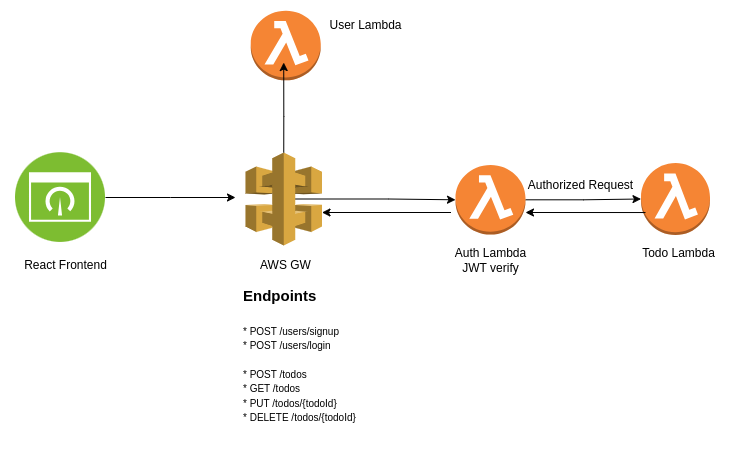

# 📝 TODO Application

This project is a full-stack TODO application built with a clear separation of frontend and backend responsibilities. The backend is developed using AWS Lambda, API Gateway, and AWS CDK, while the frontend is a single-page application which is implemented with ReactJS and hosted on Amazon S3.

---

## 📌 Features

### 🔐 User Authentication

- `POST /users/signup`: Registers a new user and returns a JWT token.
- `POST /users/login`: Authenticates an existing user and returns a JWT token.
- JWT-based authentication with a **custom AWS Lambda authorizer**.
- Input validation via **AWS Validator**.

### ✅ TODO API

- `POST /todos`: Create a new todo item.
- `PUT /todos/{todoId}`: Update an existing todo.
- `GET /todos`: Retrieve all todos for the authenticated user.
- `DELETE /todos/{todoId}`: Delete a todo.

All endpoints follow **RESTful conventions** and require a valid JWT token passed in the `Authorization` header.

---

## 📦 API Reference

### `POST /users/signup`

Registers a new user.

**Request**
```json
{
  "name": "user",
  "surname": "surname",
  "email": "user@example.com",
  "password": "securePassword123"
}
```

**Response**
```json
{
  "token": "eyJhbGciOiJIUzI1NiIsInR5..."
}
```

---

### `POST /users/login`

Logs in an existing user.

**Request**
```json
{
  "email": "user@example.com",
  "password": "securePassword123"
}
```

**Response**
```json
{
  "token": "eyJhbGciOiJIUzI1NiIsInR5..."
}
```

---

### `POST /todos`

Creates a new todo.

**Headers**
```
Authorization: Bearer <JWT_TOKEN>
```

**Request**
* due_date(optional)
```json
{
  "text": "Buy groceries",
  "due_date": "2026-05-01T00:00:00Z"
}
```

**Response**
```json
{
  "id": "uuid-123",
  "user_id": "user_id",
  "text": "Buy groceries",
  "due_date": "2026-05-01T00:00:00Z",
  "status": "TODO",
  "created_at": "2025-04-14T08:23:45.000Z",
  "updated_at": "2025-04-14T08:23:45.000Z"
}
```

---

### `PUT /todos/{todoId}`

Updates an existing todo.

**Request**
* status: "TODO" | "DONE" | "DELETED"
```json
{
  "text": "Buy groceries",
  "due_date": "2026-05-01T00:00:00Z",
  "status": "DONE"
}
```

**Response**
```json
{
  "id": "uuid-123",
  "user_id": "user_id",
  "text": "Buy groceries",
  "due_date": "2026-05-01T00:00:00Z",
  "status": "DONE",
  "created_at": "2025-04-14T08:23:45.000Z",
  "updated_at": "2025-04-14T08:25:45.000Z"
}
```

---

### `GET /todos?limit=10&offset=0`

Returns todos with limit and offset parameters for the authenticated user.

**Request**
 
**Response**
```json
[
  {
    "id": "uuid-123",
    "user_id": "user_id",
    "text": "Buy groceries",
    "due_date": "2026-05-01T00:00:00Z",
    "status": "TODO",
    "created_at": "2025-04-14T08:23:45.000Z",
    "updated_at": "2025-04-14T08:23:45.000Z"
  }
  {
    "id": "uuid-123",
    "user_id": "user_id",
    "text": "Finish homework",
    "due_date": "2026-04-15T00:00:00Z",
    "status": "TODO",
    "created_at": "2025-04-14T08:23:45.000Z",
    "updated_at": "2025-04-14T08:23:45.000Z"
  }
]
```

---

### `DELETE /todos/{todoId}`

Deletes a specific todo item.

**Response**
```json
{
  "message": "Todo deleted successfully"
}
```

---

## ☁️ Architecture Overview

The backend is entirely serverless and defined using **AWS CDK**. It includes:
- **Amazon API Gateway** for HTTP routing
- **AWS Lambda** functions for each endpoint
- **Custom Authorizer** for JWT validation
- **AWS System Manager/Parameter Store** for credentials
- **Aiven PostgreSQL** for persistent data
- **Amazon S3** for hosting the frontend

### 📊 Architecture Diagram


---

## 🧱 Database Schema

The backend uses **PostgreSQL** via Aiven. Here are the `CREATE TABLE` statements for the `users` and `todos` tables.

```sql
-- Users Table
CREATE TABLE users (
    id UUID PRIMARY KEY DEFAULT gen_random_uuid(), -- Generates a UUID by default
    name VARCHAR(255) NOT NULL,
    surname VARCHAR(255) NOT NULL,
    email VARCHAR(255) UNIQUE NOT NULL,
    password TEXT NOT NULL,
    created_at TIMESTAMP DEFAULT NOW(),
    updated_at TIMESTAMP DEFAULT NOW()
);

-- Todos Table
CREATE TABLE todos (
    id UUID PRIMARY KEY DEFAULT gen_random_uuid(), -- Auto-generated unique identifier
    user_id UUID NOT NULL, -- Links to the user who owns the todo
    text TEXT NOT NULL, -- Todo description
    status VARCHAR(10) NOT NULL CHECK (status IN ('TODO', 'DONE', 'DELETED')), -- Enum-like constraint
    due_date TIMESTAMP NULL, -- Optional deadline
    created_at TIMESTAMP DEFAULT NOW(), -- Auto-set timestamp when created
    updated_at TIMESTAMP NULL, -- Nullable, for tracking updates
    deleted_at TIMESTAMP NULL -- Nullable, for soft deletion
);
```

---

## 🚀 Deployment Details

- **Backend API Base URL:**  
  `https://zv0dtp38xl.execute-api.eu-west-1.amazonaws.com/prod`

- **Frontend URL (Hosted on S3):**  
  `http://todos-app-code-challenge-url.s3-website-eu-west-1.amazonaws.com`

---

## 🛠️ Tech Stack

- **Frontend:** React (SPA) hosted on Amazon S3
- **Backend:** Node.js on AWS Lambda
- **Routing:** Amazon API Gateway
- **Auth:** JWT-based custom authorizer
- **Infra as Code:** AWS CDK (written in TypeScript)
- **Database:** PostgreSQL (Aiven)

---


## 🧑‍💻 Developer Notes

To deploy backend infrastructure:

```bash
cd todos-serverless/
npm install
cdk deploy
```

To build and deploy the frontend to S3:

```bash
cd todos-react-frontend/
npm run build
aws s3 sync build/ s3://<your-s3-bucket-name>
```

Ensure AWS CLI is configured with appropriate credentials and region.

---
